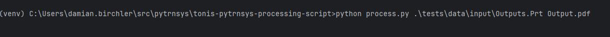

# tonis-pytrnsys-processing-script

Relevant documentation for

1. `pandas`, e.g. `plot`: https://pandas.pydata.org/pandas-docs/stable/reference/api/pandas.DataFrame.plot.html#pandas.DataFrame.plot
2. `matplotlib`, e.g. `Axes`: https://matplotlib.org/stable/api/_as_gen/matplotlib.axes.Axes.html#matplotlib.axes.Axes

You should be able to run the `process.py` script from your `pytrnsys` Python (environment). Or you can create a
separate environment just for this script (Alex can help you with that). Last but not least, the script generates a PDF
(or other formats, depending on your output file name) as is, without any interactivity. If you want to be able to zoom 
in, etc., it's easy to switch over to not saving a file but instead show you a `matplotlib` window with some 
interactivity. Again, Alex should be able to help you with that.

You can run the script like so: 



i.e. you need to type the following into some command window (with the virtual environment activated)

```cmd
python process.py .\tests\data\input\Outputs.Prt Output.pdf
```

To change the time window you're interested in, change the variables `BEGIN_DATETIME` and/or `END_DATETIME` at the top
of `process.py`.

Enjoy!